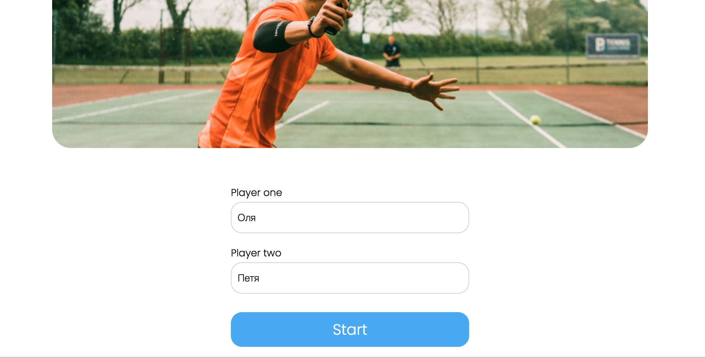
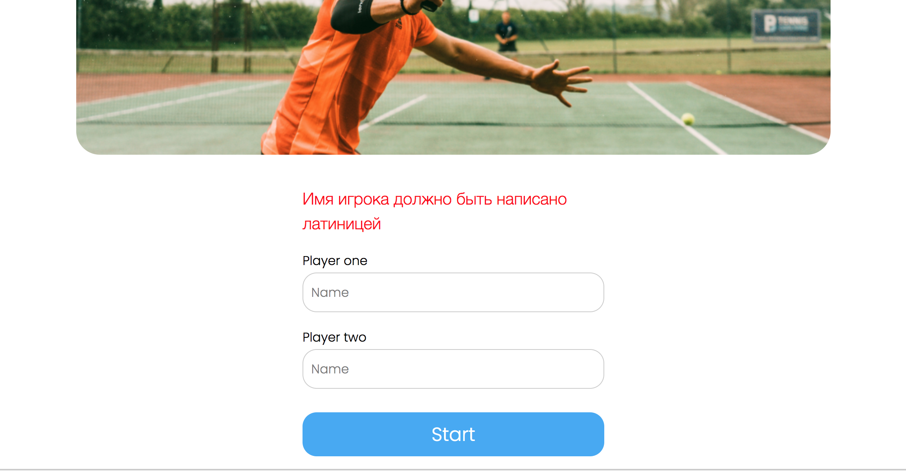
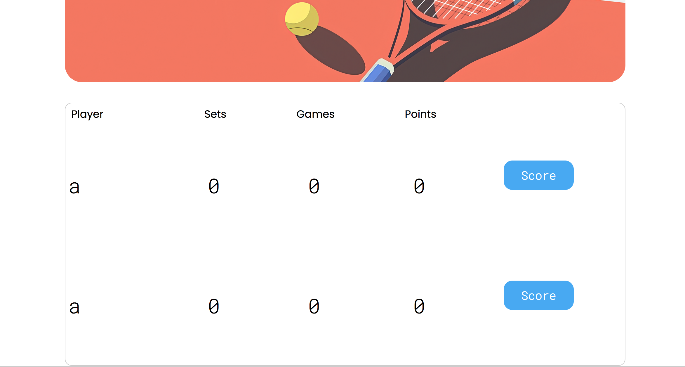
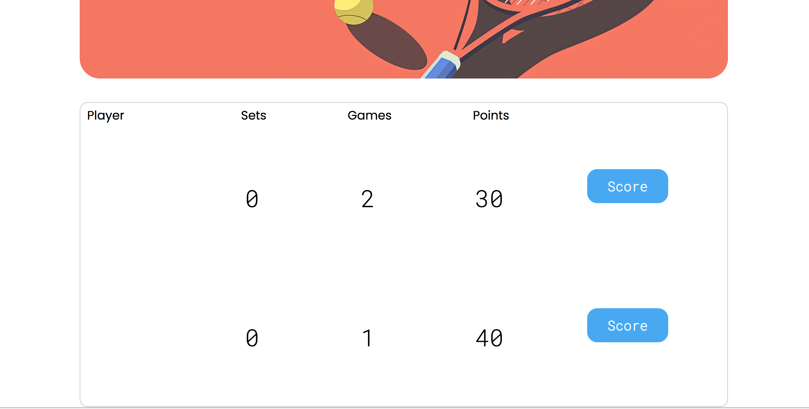
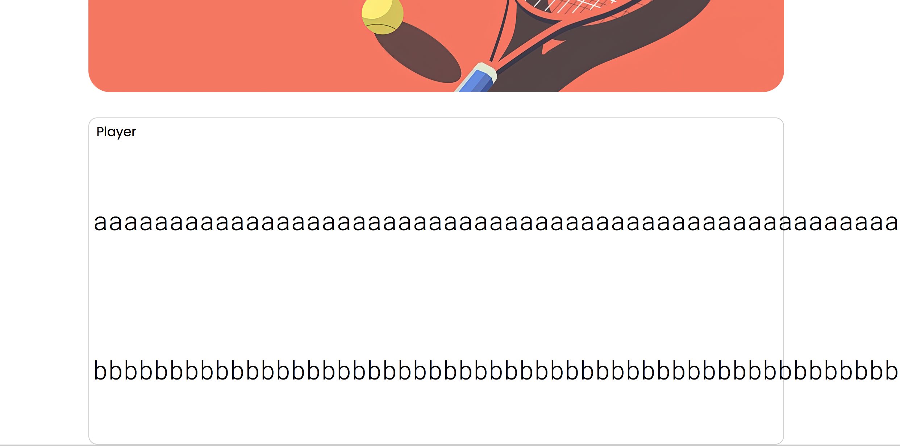
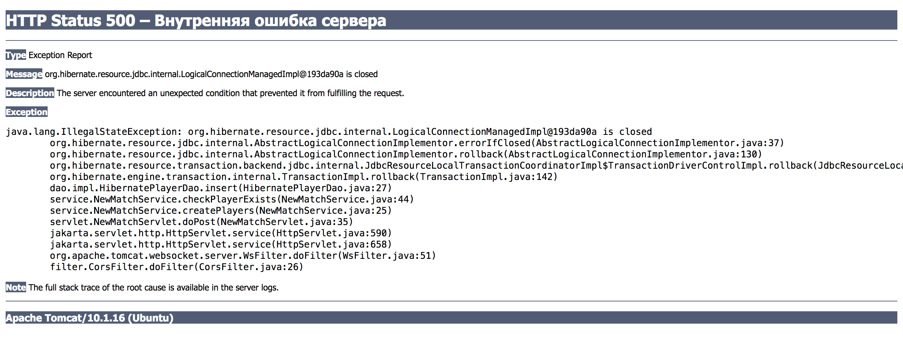
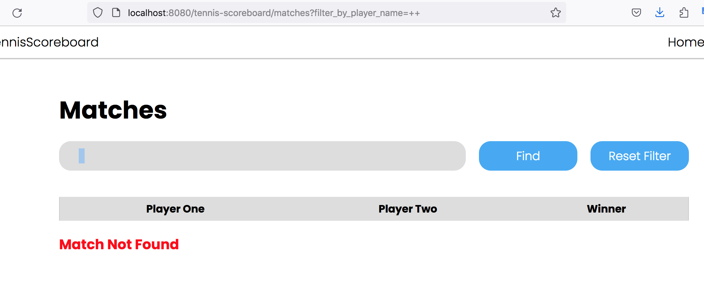
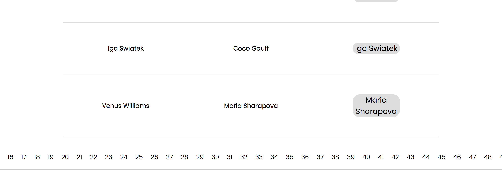

```text
Знаком ❗️ помечены критически важные замечания, а также места нарушения ТЗ.
```

## Функциональный обзор

- При использовании недопустимого имени, оно не сохраняется в поле ввода и приходится заново его печатать.





При ошибке лучше оставлять текст в поле ввода — это улучшит пользовательский опыт.

- Если использовать пробелы, можно создать игроков с визуально одинаковыми именами



- Сейчас можно создать игроков с такими именами:



Раз в проекте есть валидация, стоит добавить проверку, что в имени есть буквы и ввести другие уместные ограничения.

- Длина имени ничем не ограничена, поэтому можно создать игроков с визуально бесконечными именами.



- ❗️Из-за отсутствия ограничений на длину имени, а также потому что нет централизованной обработки исключений, сейчас при вводе имени, которое превышает максимальную длину строки в БД, пользователь видит неинформативную страницу от томката:



- При фильтрации по пустой строке сейчас не показывается ни один матч:



Вместо этого можно считать это за отсутствие фильтра и показывать все матчи. 

- ❗️В пагинации на странице завершённых матчей отображаются все страницы, что плохо выглядит при большом количестве страниц и делает недоступными страницы за пределами экрана.



Лучше сделать отображение текущей и +-2 страниц вокруг неё.

