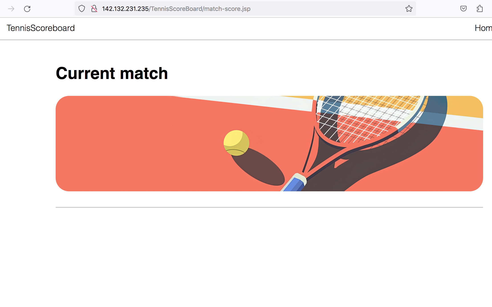

## В целом по проекту

- В некоторых классах есть неиспользуемые импорты. Перед `git commit` можно нажимать (`ctrl + alt + o` в Idea на mac os). Это работает как для текущего класса, так и для всего пакета: если выделить пакет и нажать комбинацию клавиш, то оптимизация импорта будет выполнена для всех классов в этом пакете.

- Местами в некоторых классах немного не хватает форматирования. Перед `git commit` можно нажимать (`cmd + alt + l` в Idea на mac os). Это работает как для текущего класса, так и для всего пакета: если выделить пакет и нажать комбинацию клавиш, то исправление форматирования будет выполнено для всех классов в этом пакете.

- Имена пакетов в java пишут в единственном числе. Когда смотришь на набор классов в пакете, кажется естественным использовать множественное число, обобщая то, что в нём находится, но если посмотреть на декларацию пакета в классе и сравнить варианты, например: `*.validation.limits.annotations.MaxLength` и `*.validation.limit.annotation.MaxLength`, то логика названия в единственном числе становится более понятной, так как это отображает полное имя одного (каждого) конкретного класса.

- ❗️Сейчас JSP страницы находятся в `src/main/webapp/`. Это корневая директория веб-приложения, и любая страница в нём доступна по прямому URL.

Например, сейчас можно открыть http://142.132.231.235/TennisScoreBoard/match-score.jsp и увидеть пустую страницу, предназначенную для текущего матча, котора должна быть доступна только при определённых условиях (когда матч создан).

View (страницы JSP) не должен быть доступен в обход Controller (сервлета), поэтому стоит поместить все JSP страницы внутрь `WEB-INF`.

- ❗️Не все исключения от Hibernate и БД (а также некоторые другие) обрабатываются должным образом, поэтому, при любой такой ошибке во время работы приложения, пользователь видит страницу с неинформативным сообщением. Следует использовать специализированные исключения, чтобы оборачивать в них возникающие ошибки и убедиться, что они обрабатываются в фильтре (или другом предусмотренном месте), чтобы улучшить пользовательский опыт, доступно информируя о том, что пошло не так.

- Сейчас в репозитории две версии README файла.

